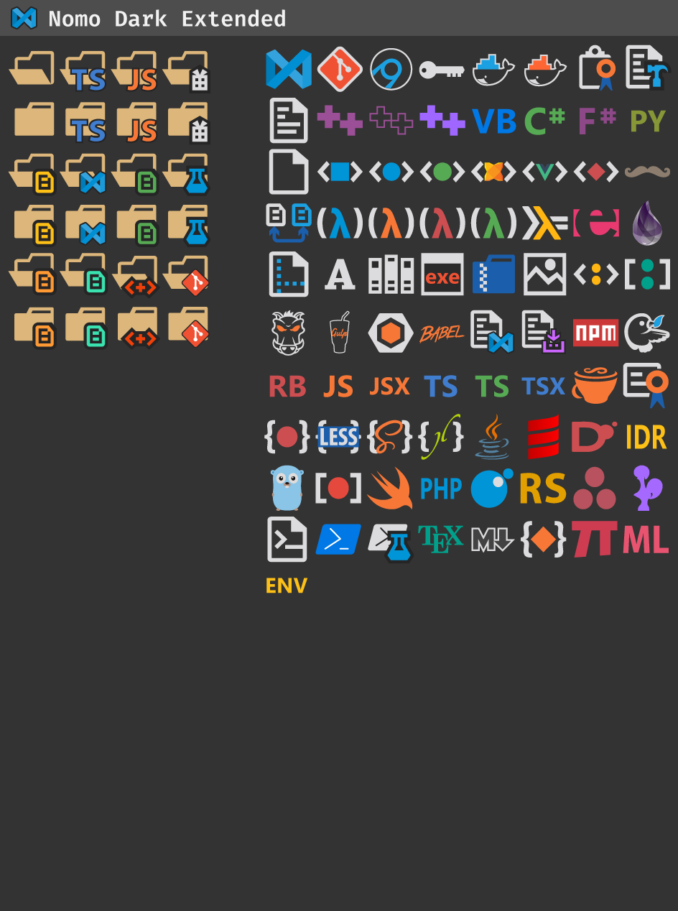

# Nomo Dark Extended Icon Set

---

Forked from [be5invis/vscode-iconset](https://github.com/be5invis/vscode-iconset)

#### How to use:

1. Download and install the icon set.
2. Select File Icon Theme to Nomo Dark Extended.

## Icon Preview

))